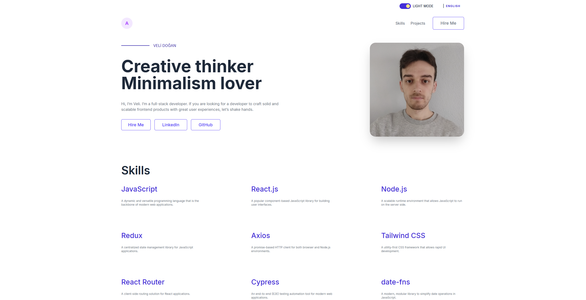

# 🌐 Personal Portfolio Website

A personal portfolio website created to showcase my projects, skills, and contact information.

This project serves as my **developer portfolio**.

## 🚀 Features

- About me section
- Projects showcase
- Skills section
- Responsive design
- Clean UI layout
- Light / Dark Mode
- TR/EN Translate

## 🛠️ Technologies Used

- HTML
- Vite-React
- Redux Toolkit
- TanStack Query
- Axios
- React Toastify
- Cypress
- Tailwindcss (Dark/Light)

## 📂 Project Structure

```
  personal-site
  ├── src
      ├── App.jsx
      ├── main.jsx
      ├── components
      ├── css
      ├── hooks
      ├── layouts
      ├── lib
        ├── api
        ├── providers
        ├── services
        ├── store
  ├── .env
  └── README.md
```

## ⚙️ Installation

Clone the repository

```
git clone https://github.com/velidogan120/personal-site.git
```

Install dependencies

```
npm install
```

Run the development server

```
npm run dev
```

Open in browser

```
http://localhost:5173
```

## ⚙️ Cypress Testing

Open Terminal run command

```
npx cypress open
```

Select E2E Testing and All situations, Tests will be execution

## 🎯 Purpose

This project was created to:

- Build a personal developer portfolio
- Showcase projects
- Practice responsive web design
- Improve frontend development skills

## 📸 Screenshots

<p>
  
</p>

## 👨‍💻 Author

Veli Doğan
https://github.com/velidogan120
